# Basics
## Syntax and Structure
### Program 1
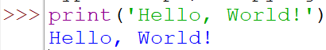
### Program 2
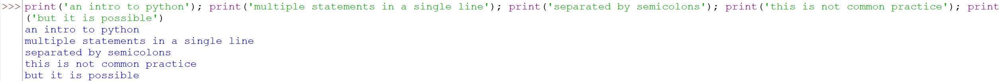
### Program 3
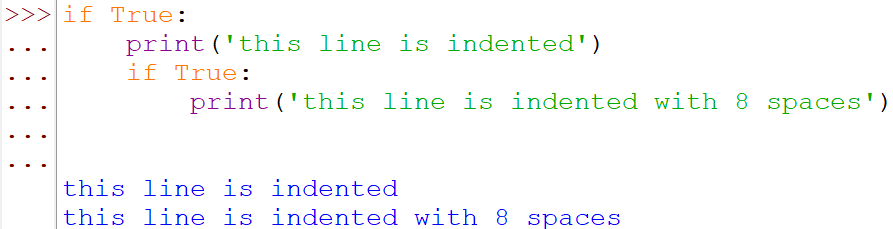
### Program 4
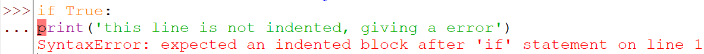
### Program 5
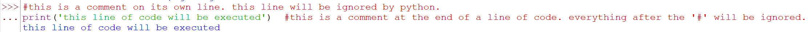
### Program 6
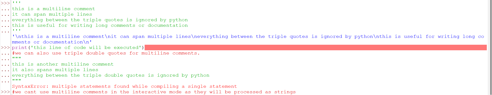
### Program 7
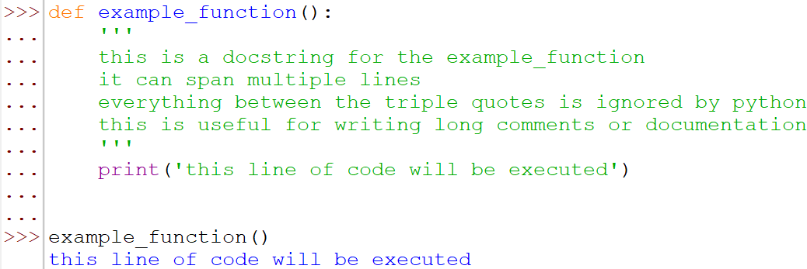

### Program 8
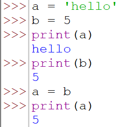
### Program 9
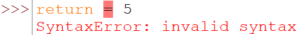
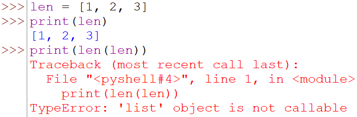
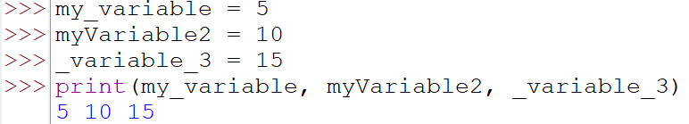
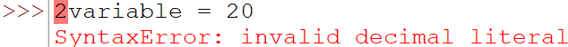
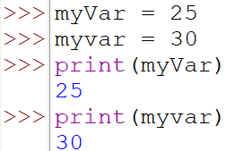

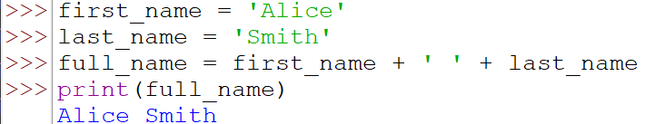
### Program 10
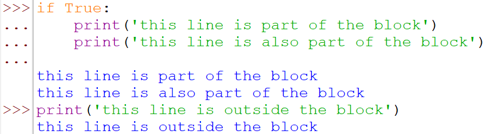
## Data types and variables
### Proogram 1

### Program 2
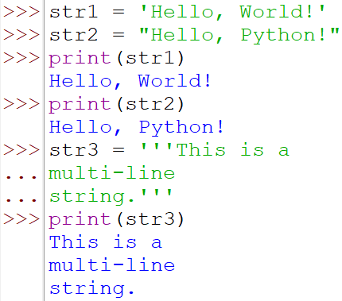
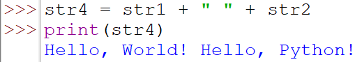
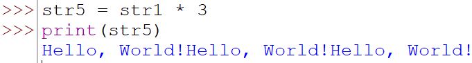
### Program 3
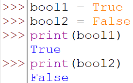
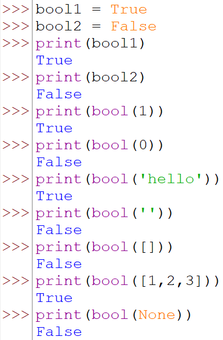
### Program 4
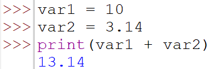
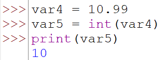
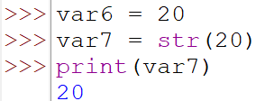
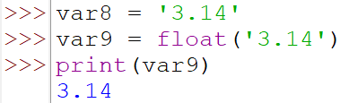
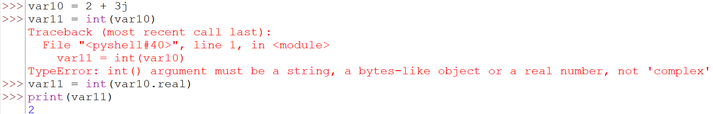
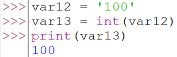
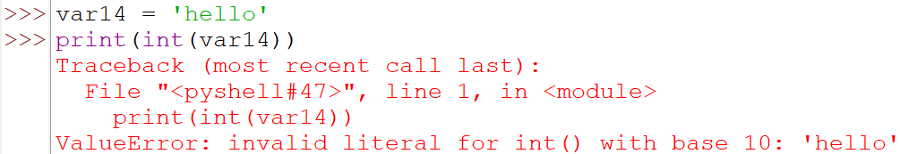
### Program 5
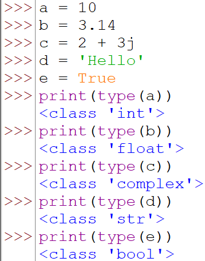
### Program 6
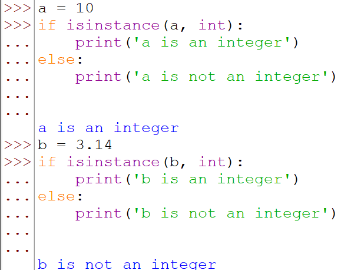
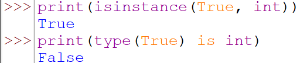
### Program 7

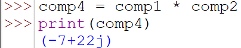
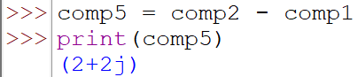
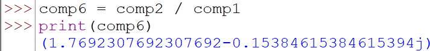
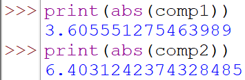
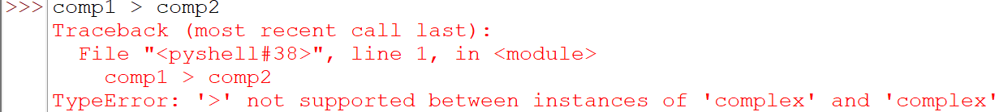
### Program 8
### Program 9
### Program 10