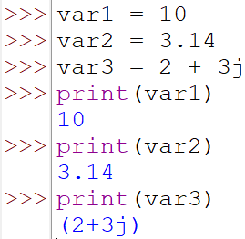

# Basics
## Syntax and Structure
### Program 1

### Program 2

### Program 3

### Program 4

### Program 5

### Program 6

### Program 7

### Program 8

### Program 9

### Program 10

## Data types and variables
### Proogram 1

### Program 2

### Program 3

### Program 4

### Program 5

### Program 6

### Program 7

### Program 8
### Program 9
### Program 10